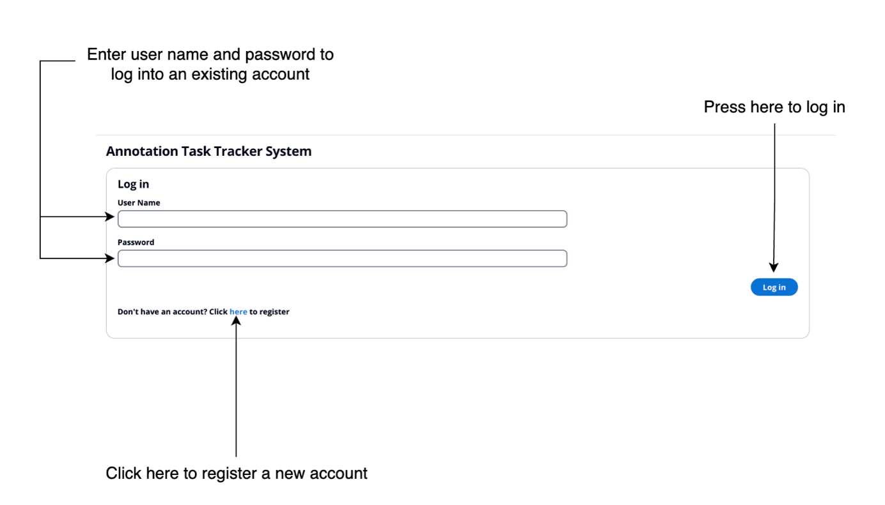
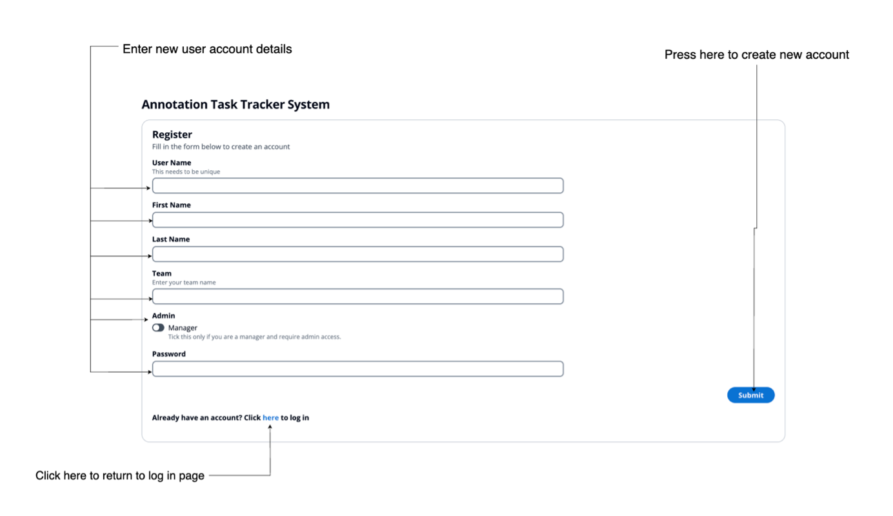
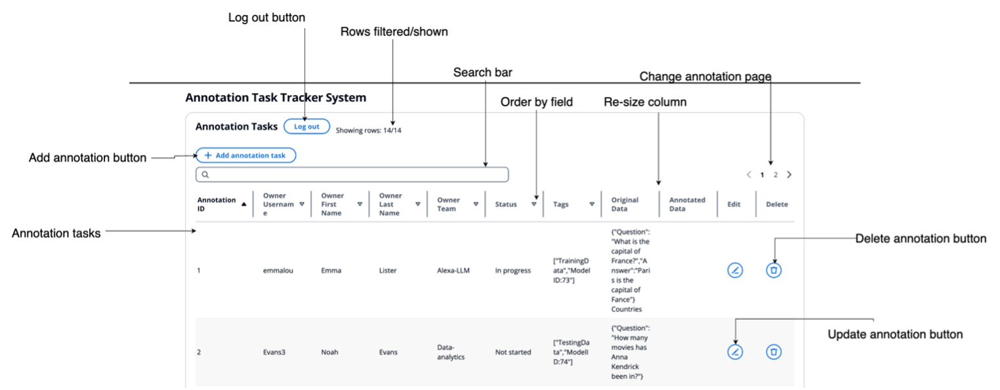
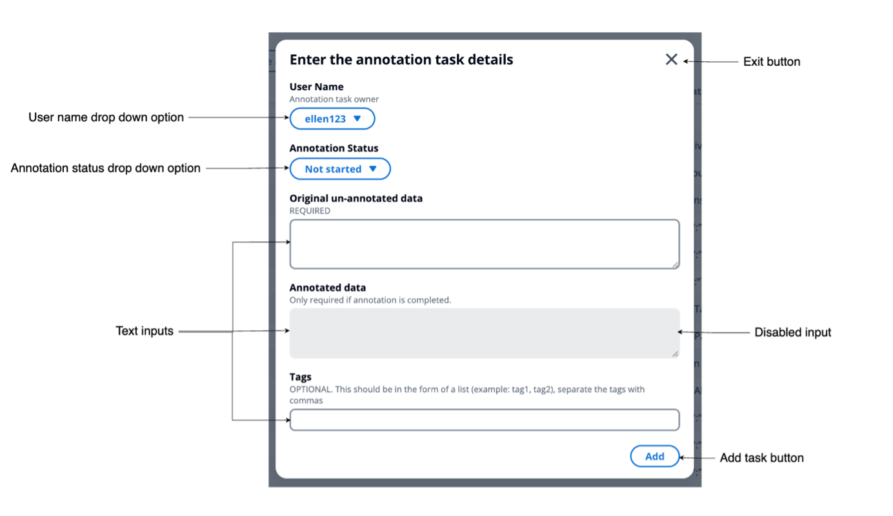
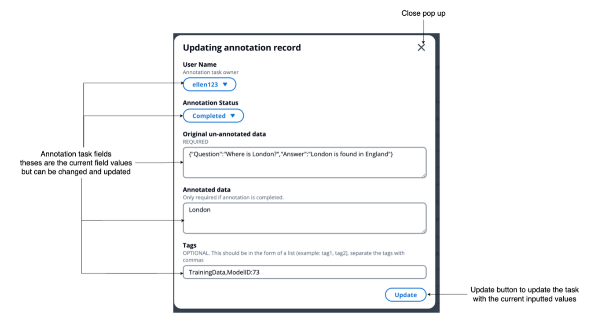

# Annotation Task Tracker Frontend

This project was bootstrapped with [Create React App](https://github.com/facebook/create-react-app). And the site used React.

For the UI components, this package uses [AWS Cloudscape](https://cloudscape.design/).

## Installation and set up

- Ensure you have node and npm
- Run `npm install` - this will install all libraries and packages needed for running this app.
- If you want to connect to a locally running API then change the `API_URL` const in the config file to the local running API URL.
- Run `npm start` to start running the app locally. 

## Linter

You can apply [prettier](https://prettier.io/) linter by running `npx prettier . --write`

To apply [ESLinter](https://typescript-eslint.io/) run `npx eslint .`

## Available Scripts

In the project directory, you can run:

### `npm start`

Runs the app in the development mode.\
Open [http://localhost:3000](http://localhost:3000) to view it in your browser.

The page will reload when you make changes.\
You may also see any lint errors in the console.

### `npm test`

Launches the test runner in the interactive watch mode.\
See the section about [running tests](https://facebook.github.io/create-react-app/docs/running-tests) for more information.

### `npm run build`

Builds the app for production to the `build` folder.\
It correctly bundles React in production mode and optimizes the build for the best performance.

The build is minified and the filenames include the hashes.\
Your app is ready to be deployed!

See the section about [deployment](https://facebook.github.io/create-react-app/docs/deployment) for more information.

### `npm run eject`

**Note: this is a one-way operation. Once you `eject`, you can't go back!**

If you aren't satisfied with the build tool and configuration choices, you can `eject` at any time. This command will remove the single build dependency from your project.

Instead, it will copy all the configuration files and the transitive dependencies (webpack, Babel, ESLint, etc) right into your project so you have full control over them. All of the commands except `eject` will still work, but they will point to the copied scripts so you can tweak them. At this point you're on your own.

You don't have to ever use `eject`. The curated feature set is suitable for small and middle deployments, and you shouldn't feel obligated to use this feature. However we understand that this tool wouldn't be useful if you couldn't customize it when you are ready for it.

## UI User Manual
The UI is hosted on Render and can be accessed here: https://annotationtasktrackerfrontend.onrender.com/

Please note, when there has been a long period of inactivity with the backend it will shut down causing new calls to take a
long time (approximately 2 minutes) due to waiting for the instance to spin up again so please be patient.

#### Log In/Register Page
The login page below is the first page you are met with when opening the application.

*Steps on how to log into an existing user account:*
1. Open the application
2. Enter the account username and password.
3. Click “Log in”.
4. Then you will be taken to the Annotation Task page.

Below is the register page.

*Steps on how to create a new user:*
1. Open the application
2. Click on the link at the bottom of the login form to open the register page.
3. Enter the form inputs (Note: the manager toggle input will determine what permissions you have on your account that
you are creating. If you want to be able to perform all actions (create, read, update and delete) then tick this.
If you want a regular user account (create, read and update actions) then do not tick this).
4. Click “Submit”.
5. Then you will be taken to the Annotation Task page.

#### Annotation Page
Below is the annotation page where you are taken after you have logged in. On this page you can manage the annotation tasks.

*How to view the annotation tasks in the annotation page:*
1. Open the application.
2. Either log into an existing account or create a new account (see instructions above).
3. After this you will be taken to the Annotation Task page.
4. Here you can see manage the annotation tasks.

*Annotation task management actions you can do here:*
1. View all the annotation tasks - this includes searching/filtering through the rows, expanding the column and ordering by column values.
2. Add annotation task – this is done by clicking the “Add Annotation Task” button and following the pop-up seen below.

3. Update annotation task - click on the pencil icon at the end of the row you want to update.
You will be taken to the following pop-up to update the task fields.
You need admin access or be the owner of the annotation task to do this.

4. Delete annotation task - click on the bin icon at the end of the row you want to delete. You need admin access to do this.

## Learn More

You can learn more in the [Create React Route documentation](https://facebook.github.io/create-react-app/docs/getting-started).

To learn React, check out the [React documentation](https://reactjs.org/).

### Code Splitting

This section has moved here: [https://facebook.github.io/create-react-app/docs/code-splitting](https://facebook.github.io/create-react-app/docs/code-splitting)

### Analyzing the Bundle Size

This section has moved here: [https://facebook.github.io/create-react-app/docs/analyzing-the-bundle-size](https://facebook.github.io/create-react-app/docs/analyzing-the-bundle-size)

### Making a Progressive Web Route

This section has moved here: [https://facebook.github.io/create-react-app/docs/making-a-progressive-web-app](https://facebook.github.io/create-react-app/docs/making-a-progressive-web-app)

### Advanced Configuration

This section has moved here: [https://facebook.github.io/create-react-app/docs/advanced-configuration](https://facebook.github.io/create-react-app/docs/advanced-configuration)

### Deployment

This section has moved here: [https://facebook.github.io/create-react-app/docs/deployment](https://facebook.github.io/create-react-app/docs/deployment)

### `npm run build` fails to minify

This section has moved here: [https://facebook.github.io/create-react-app/docs/troubleshooting#npm-run-build-fails-to-minify](https://facebook.github.io/create-react-app/docs/troubleshooting#npm-run-build-fails-to-minify)
